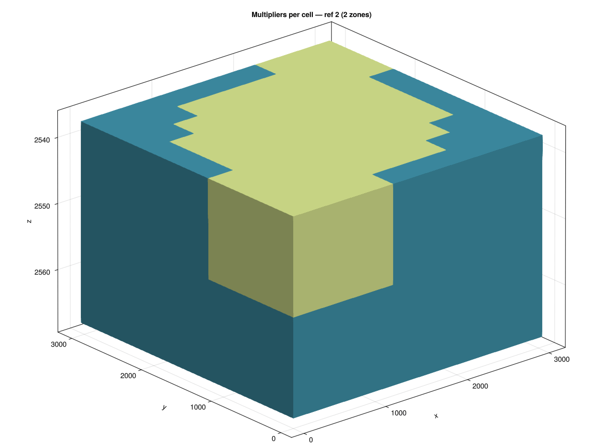
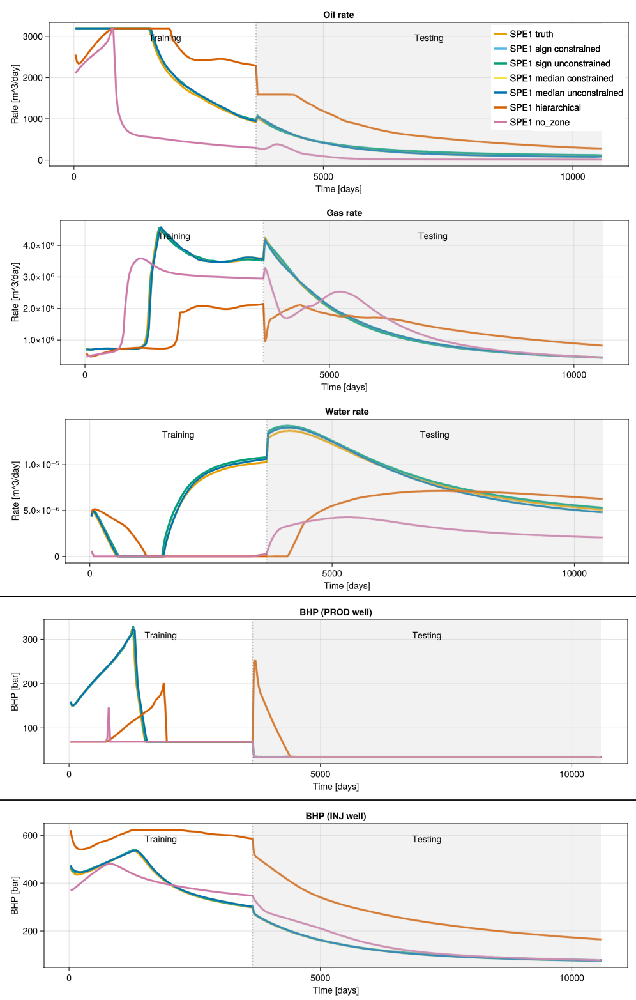

# Multipliers Zonation for Reservoir History Matching
This repository is the companion codebase for our paper "Multipliers Zonation for Reservoir History Matching". It contains the full workflow we used in the study: optimization code, zonation strategies, deck variants, generated permeability files, logs, and figure outputs used for analysis and reporting.

## What you can reproduce here

- Zonation-aware history matching with iterative refinement + L-BFGS multiplier optimisation
- A no-zonation baseline (per-cell multipliers)
- Train/test behaviour across prepared deck variants
- Outputs used in the analysis: permeability fields, rate/BHP curves, optimisation logs

## Visual Overview
### How the model is divided into zones
<p align="center">
   
</p>

### Rates and BHP comparison across zoning strategies
<p align="center">
   
</p>

## Installation
### Supported Software Versions
- Julia: `1.12.0` (the checked-in `Manifest.toml` was generated with this version).
- OS: Linux/macOS/Windows with a working Julia installation.
- Graphics: for interactive 3D plotting (`GLMakie`), an OpenGL-capable environment is required.
- Headless environments: plotting calls may need to be disabled or procede to use `CLMakie`.

### Install Steps
1. Clone the repository and enter it:
   ```bash
   git clone https://github.com/deepfield-team/History-matching.git
   cd History-matching
   ```
2. Instantiate dependencies:
   ```bash
   julia --project=. -e 'using Pkg; Pkg.instantiate(); Pkg.precompile()'
   ```

## Getting Started
### 1. Run zonation-aware history matching (main workflow)
```bash
julia --project=. experiments/code_spe1_zone_LBFGS.jl
```
What this run does:
- Loads SPE1 reference data.
- Runs iterative refinement + L-BFGS multiplier optimization.
- Writes permeability include file(s) into `models/inc/`.
- Writes logs and rate curves into `experiments/logs/`.
- Displays plots (loss, gradients, permeability, rates).

### 2. Run no-zonation baseline
```bash
julia --project=. experiments/code_spe1_no_zone.jl
```
This optimizes per-cell multipliers directly and writes `models/inc/spe1_no_zone_perm.inc`.

### 3. Compare train/test behavior across deck variants
```bash
julia --project=. experiments/code_spe1_train_test_rates.jl
```
This script simulates prepared deck variants and plots train/test curves for selected QoIs.

### 4. Change refinement strategy
Edit `experiments/code_spe1_zone_LBFGS.jl`:
- Set `ZONING_TECHNIQUE_KEY` to one of: `sign_uncons`, `sign_cons`, `medium-cons`, `medium_uncons`, `hierarchical clustering`.

### Regenerating include files
Running the optimization scripts regenerates include files automatically:
- Zonation workflow writes files like `models/inc/spe1_zone_LBFGS_perm_<technique>.inc`.
- No-zonation workflow writes `models/inc/spe1_no_zone_perm.inc`.

## Repository Structure
```text
.
├── src/
├── experiments/
├── models/
├── pics/
├── Project.toml
├── Manifest.toml
└── README.md
```

## Data Files: Where to Get Them
- Base SPE1 deck: `models/SPE1.DATA` (used from `GeoEnergyIO`).
- Variant deck (sign constrained): `models/SPE1_sign_cons.DATA`
- Variant deck (sign unconstrained): `models/SPE1_sign_uncons.DATA`
- Variant deck (median constrained): `models/SPE1_medium-cons.DATA`
- Variant deck (median unconstrained): `models/SPE1_medium_uncons.DATA`
- Variant deck (hierarchical clustering): `models/SPE1_hierarchical clustering.DATA`
- Variant deck (no zoning): `models/spe1_no_zone.DATA`
- Permeability include files referenced by variant decks: `models/inc/*.inc`

### `experiments/` (entry-point scripts and outputs)
- `experiments/code_spe1_zone_LBFGS.jl`: main zonation-aware optimization pipeline.
- `experiments/code_spe1_no_zone.jl`: no-zonation baseline optimization.
- `experiments/code_spe1_train_test_rates.jl`: train/test comparison across prepared decks.
